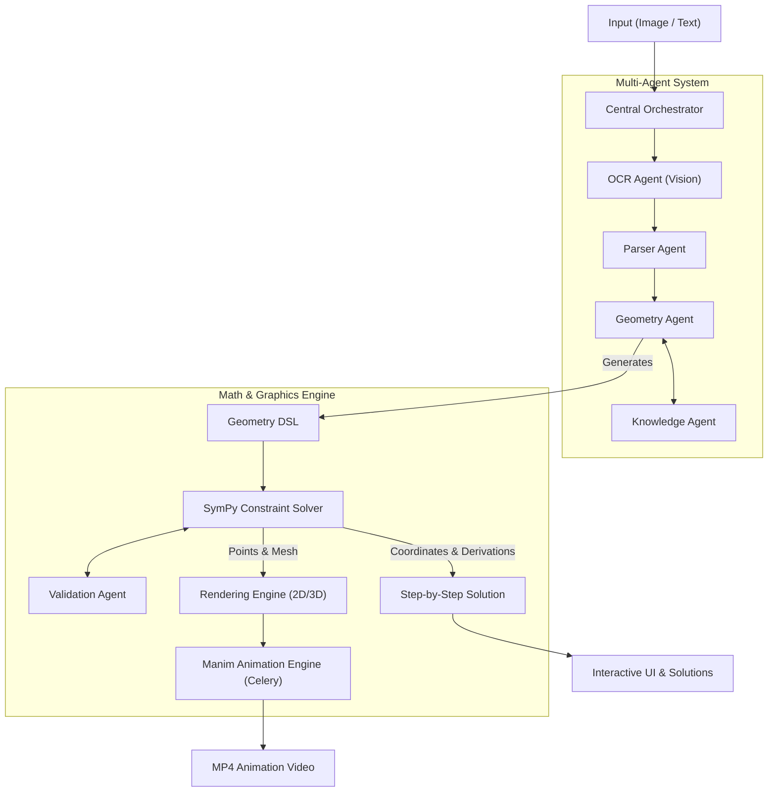

# 📐 Visual Math Solver v5.1 — Multi-Agent Geometry & Step-by-Step AI Engine

<div align="center">

[](https://python.org)
[](https://fastapi.tiangolo.com/)
[](https://nextjs.org/)
[](https://www.sympy.org/)
[](https://www.manim.community/)
[](https://www.docker.com/)
[](https://redis.io/)
[](LICENSE)

<p align="center">
An advanced multi-agent system for automated geometry problem solving, exact symbolic calculation, 2D/3D interactive visualization, and dynamic Manim video animations.
</p>

</div>

---

## 📽️ Media Demo

<div align="center">
  
  <p><i>Figure 1: Visual Math Solver v5.1 Multi-Agent Engine & Interactive Showcase</i></p>
</div>

---

## ✨ Key Highlights

- 🤖 **Multi-Agent Orchestration**: Sequential and verification loop pipeline combining OCR Agent, Parser Agent, Geometry Agent, Knowledge Agent, Solver Agent, and Validation Agent.
- 🧮 **SymPy Symbolic Constraint Solver**: Computes exact symbolic coordinates, geometric constraints, proofs, angles, and step-by-step derivations.
- 📐 **Geometry DSL**: Declarative domain-specific representation containing geometric mesh definitions independent of rendering platforms.
- 🎬 **Manim 2D & 3D Video Rendering**: Asynchronous generation of high-definition mathematical video animations via Celery queues and Supabase CDN storage.
- 🔄 **Multi-LLM Fallback Pipeline**: High availability via sequential multi-model fallback (`OpenRouter Model 1` ➔ `Model 2` ➔ `Model 3`).
- 💬 **Multi-Session & State History**: Seamless persistence of geometric canvas states, step-by-step solution history, and interactive 2D/3D view switches.

---

## 🏗️ System Architecture



---

## 📁 Repository Structure

```
MathSolver/
├── backend/               # FastAPI app, Multi-Agent pipeline, SymPy solver, Manim renderer
│   ├── app/               # FastAPI core routes (/solve, /render_video)
│   ├── agents/            # Multi-Agent logic (OCR, Parser, Geometry, Solver, Validation)
│   ├── solver/            # SymPy constraint solver & Geometry DSL parser
│   ├── worker/            # Celery asynchronous queues (render, ocr)
│   └── setup.sh           # System dependency installation script
├── frontend/              # Next.js web application with interactive canvas
├── docs/                  # Complete technical specs, API docs, & architecture
├── Dockerfile             # Production Docker container for Hugging Face Spaces (Port 7860)
├── docker-compose.yml     # Local multi-container orchestration (Backend, Worker, Redis, FE)
└── app.py                 # Hugging Face Spaces entrypoint
```

---

## 🛠️ Setup & Installation

### 1. Prerequisites (macOS / Linux)
System libraries (`Cairo`, `Pango`, `FFmpeg`, `LaTeX`) are required for Manim video rendering:
```bash
cd backend
chmod +x setup.sh
./setup.sh
```

### 2. Environment Configuration
Set up your environment variables based on `.env.example` in `backend/` and `frontend/`:
```bash
# backend/.env
OPENROUTER_API_KEY_1=your_openrouter_key
OPENROUTER_MODEL_1=google/gemini-2.5-flash
OPENROUTER_MODEL_2=anthropic/claude-3.5-sonnet
OPENROUTER_MODEL_3=openai/gpt-4o
REDIS_URL=redis://localhost:6379/0
SUPABASE_URL=your_supabase_url
SUPABASE_KEY=your_supabase_anon_key

# frontend/.env.local
NEXT_PUBLIC_API_URL=http://localhost:8000
NEXT_PUBLIC_WS_URL=ws://localhost:8000
```

### 3. Running Services Locally

#### Backend (FastAPI API Server)
```bash
cd backend
source venv/bin/activate
uvicorn app.main:app --host 0.0.0.0 --port 8000 --reload
```

#### Asynchronous Worker (Celery Render Engine)
```bash
cd backend
source venv/bin/activate
celery -A worker.celery_app worker --loglevel=debug -Q render,ocr
```

#### Frontend (Next.js App)
```bash
cd frontend
npm install
npm run dev
```
Access the application at [http://localhost:3000](http://localhost:3000).

---

### 4. Running via Docker Compose
Run the entire application stack using Docker:
```bash
docker-compose up --build
```

---

### 5. Port Cleanup Utility (LSOF)
If ports are blocked (`Address already in use`), release active ports:
```bash
# Note: lsof stands for list open files
lsof -ti :8000,3000,6379 | xargs kill -9
```

---

## 📖 Usage & API Reference

<details>
  <summary><b>Click to expand API Request & Solution Payload Example</b></summary>

```json
// POST /solve
{
  "problem_statement": "Given right triangle ABC at A, AB=3, AC=4. Calculate area and render solution.",
  "output_format": "interactive_2d"
}

// Response Payload:
{
  "status": "success",
  "coordinates": {
    "A": [0, 0],
    "B": [3, 0],
    "C": [0, 4]
  },
  "solution": {
    "answer": "6 cm²",
    "steps": [
      "Step 1: Assign vertex coordinates A(0,0), B(3,0), C(0,4).",
      "Step 2: Apply triangle area formula S = 1/2 * base * height.",
      "Step 3: Compute S = 1/2 * 3 * 4 = 6."
    ],
    "symbolic_expression": "6"
  }
}
```

</details>

---

## ❓ Troubleshooting

| Issue / Error | Possible Cause | Solution |
|---|---|---|
| `Failed to fetch` | Backend service offline or reloading | Wait a few seconds; confirm Backend is running on port 8000 or HF Space endpoint. |
| `zsh: command not found: sof` | Typo in command name | Use exact `lsof` command (`L-S-O-F`): `lsof -ti :8000,3000 \| xargs kill -9`. |
| `Internal Server Error` | Redis connection missing | Verify `REDIS_URL` in `.env` and ensure Redis service is running. |
| `ParseError` (Manim) | Missing system dependencies (`Pango`/`Cairo`) | Re-run `./setup.sh` inside `backend/` directory or run inside Docker. |

---

## 🚀 Deployment

For production deployment instructions to **Hugging Face Spaces (Docker SDK)** and **Vercel**, refer to the detailed [DEPLOYMENT.md](file:///Volumes/WorkSpace/Project/MathSolver/DEPLOYMENT.md) documentation.

---

## 📄 License & Acknowledgments

This project is licensed under the [MIT License](LICENSE). Developed with modern AI multi-agent principles for interactive mathematical visualization.
