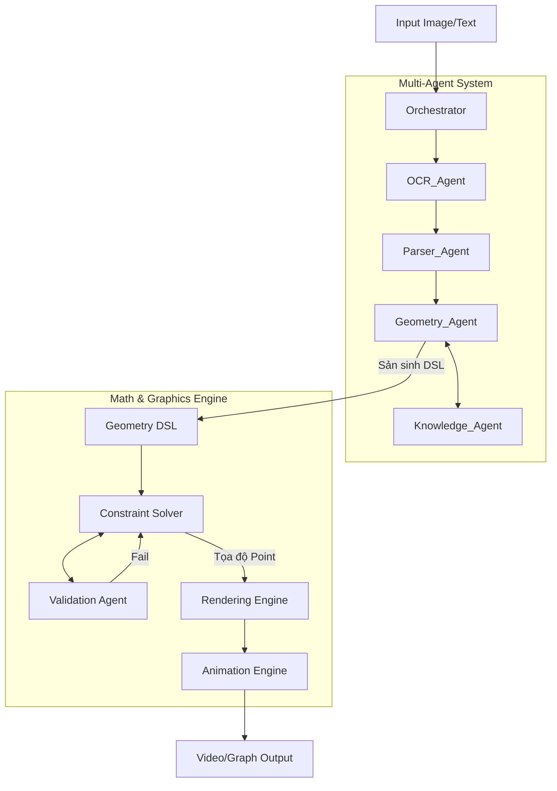

# Kiến trúc Hệ thống: Visual Math Solver v3.0

Tài liệu mô tả kiến trúc tổng thể của hệ thống **Visual Math Solver v3.0** dưạ vào thiết kế Multi-Agent.

## 1. Tổng quan Kiến trúc (Core Architecture)
Hệ thống kết hợp giữa khả năng hiểu ngữ nghĩa của AI và sức mạnh tính toán của công cụ Symbolic Math:
- **LLM/Vision (AI Layer)**: Phụ trách hiểu đề, bóc tách dữ liệu từ hình ảnh và văn bản tự nhiên.
- **Symbolic Engine & Constraint Solver**: Framework xử lý toán học chính xác tuyệt đối, lập phương trình và giải toạ độ.
- **Geometry DSL**: Trái tim của hệ thống, ngôn ngữ khai báo độc lập chứa toàn bộ định nghĩa lưới hình học của bài toán.
- **Rendering Engine**: Động cơ chuyển đổi tọa độ điểm và các mối liên hệ hình học thành hình vẽ đồ họa trực quan và animation video.

## 2. Kiến trúc Agent (Agent-based Workflow)
Hệ thống hoạt động dưới sự điều phối của một Orchestrator trung tâm phân loại và chuyển tiếp các tác vụ tới các Agent chuyên biệt theo đường ống tuần tự kết hợp vòng lặp kiểm chứng.

## 3. Tech Stack Khuyến nghị
- **Backend Core**: FastAPI (Python) - hiệu năng cao cho I/O, AI routing.
- **Toán học & Giải phương trình**: `SymPy`, `NumPy`.
- **AI/LLM**: Các model tối ưu cho toán như MegaLLM/GPT-4o, Local Models cho OCR (TrOCR, Pix2Tex).
- **Trực quan hoá (Render/Animation)**: `Manim` (cho production video generator).
- **Frontend App**: Next.js kết hợp Three.js / GeoGebra SDK (cho việc view tương tác).
