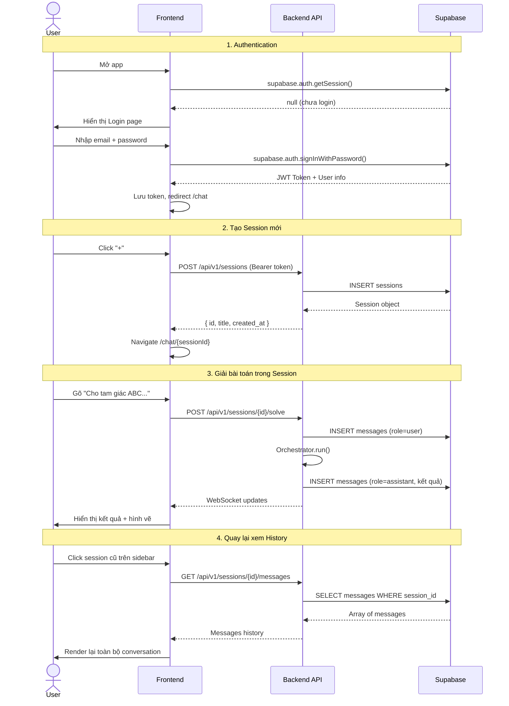

# Tài liệu Nâng cấp: Multi-Session Chat với History

> **Phiên bản mục tiêu**: MathSolver v4.0  
> **Ngày tạo**: 2026-03-31  
> **Mục tiêu**: Cho phép nhiều user sử dụng hệ thống, mỗi user tạo được nhiều session chat, mỗi session lưu đầy đủ history.

---

## 1. Phân tích Hiện trạng (AS-IS)

### 1.1 Những gì đang có
| Thành phần | Hiện trạng | Vấn đề |
|---|---|---|
| **Authentication** | Không có | Bất kỳ ai cũng dùng được, không phân biệt user |
| **Session** | Single session duy nhất | State lưu trong React `useState`, mất khi reload |
| **Chat History** | Không persist | Messages chỉ tồn tại trong memory của browser |
| **Database** | Supabase chỉ có bảng `jobs` | Không có bảng `users`, `sessions`, `messages` |
| **API** | Stateless, không gắn user | `/api/v1/solve` không biết ai gửi request |

### 1.2 Cấu trúc Database hiện tại
```sql
-- Chỉ có 1 bảng duy nhất
CREATE TABLE public.jobs (
    id UUID PRIMARY KEY,
    status TEXT DEFAULT 'processing',
    input_text TEXT,
    result JSONB DEFAULT '{}',
    created_at TIMESTAMPTZ DEFAULT NOW(),
    updated_at TIMESTAMPTZ DEFAULT NOW()
);
```

### 1.3 Cấu trúc Frontend hiện tại
- `page.tsx`: Single-page, tất cả state nằm trong `useState`
- `ChatSidebar.tsx`: Hiển thị messages nhưng không có danh sách sessions
- `types/chat.ts`: Đã có `ChatMessage` type nhưng thiếu `Session`, `User`

---

## 2. Kiến trúc Mục tiêu (TO-BE)

### 2.1 Tổng quan

```
┌─────────────────────────────────────────────────────┐
│                    Frontend (Next.js)                │
│  ┌──────────┐  ┌──────────────┐  ┌───────────────┐  │
│  │ Auth UI  │  │ Session List │  │ Chat Window   │  │
│  │ (Login/  │  │ (Sidebar)    │  │ (Messages +   │  │
│  │  SignUp) │  │              │  │  Solver)      │  │
│  └────┬─────┘  └──────┬───────┘  └───────┬───────┘  │
│       │               │                  │          │
└───────┼───────────────┼──────────────────┼──────────┘
        │               │                  │
   ┌────▼───────────────▼──────────────────▼──────────┐
   │              Backend (FastAPI)                    │
   │  ┌──────────┐  ┌────────────┐  ┌──────────────┐  │
   │  │ Auth     │  │ Session    │  │ Solve        │  │
   │  │ Middleware│  │ CRUD API   │  │ API (hiện có)│  │
   │  └────┬─────┘  └─────┬──────┘  └──────┬───────┘  │
   └───────┼───────────────┼────────────────┼──────────┘
           │               │                │
   ┌───────▼───────────────▼────────────────▼──────────┐
   │              Supabase                             │
   │  ┌───────┐ ┌──────────┐ ┌──────────┐ ┌────────┐  │
   │  │ users │ │ sessions │ │ messages │ │ jobs   │  │
   │  │ (Auth)│ │          │ │          │ │(giữ lại)│  │
   │  └───────┘ └──────────┘ └──────────┘ └────────┘  │
   └───────────────────────────────────────────────────┘
```

---

## 3. Database Schema Mới

### 3.1 File: `docs/supabase_schema_v4.sql`

```sql
-- ============================================================
-- MATHSOLVER v4.0 - Multi-Session Schema
-- ============================================================

-- 1. Sử dụng Supabase Auth (bảng auth.users có sẵn)
--    Không cần tạo bảng users thủ công.

-- 2. Bảng profiles (mở rộng thông tin user)
CREATE TABLE public.profiles (
    id UUID PRIMARY KEY REFERENCES auth.users(id) ON DELETE CASCADE,
    display_name TEXT,
    avatar_url TEXT,
    created_at TIMESTAMPTZ DEFAULT NOW(),
    updated_at TIMESTAMPTZ DEFAULT NOW()
);

-- Auto-create profile khi user đăng ký
CREATE OR REPLACE FUNCTION public.handle_new_user()
RETURNS TRIGGER AS $$
BEGIN
    INSERT INTO public.profiles (id, display_name)
    VALUES (NEW.id, COALESCE(NEW.raw_user_meta_data->>'full_name', NEW.email));
    RETURN NEW;
END;
$$ LANGUAGE plpgsql SECURITY DEFINER;

CREATE TRIGGER on_auth_user_created
    AFTER INSERT ON auth.users
    FOR EACH ROW EXECUTE FUNCTION public.handle_new_user();

-- 3. Bảng sessions (phiên chat)
CREATE TABLE public.sessions (
    id UUID PRIMARY KEY DEFAULT gen_random_uuid(),
    user_id UUID NOT NULL REFERENCES auth.users(id) ON DELETE CASCADE,
    title TEXT DEFAULT 'Bài toán mới',
    created_at TIMESTAMPTZ DEFAULT NOW(),
    updated_at TIMESTAMPTZ DEFAULT NOW()
);

CREATE INDEX idx_sessions_user_id ON public.sessions(user_id);
CREATE INDEX idx_sessions_updated_at ON public.sessions(updated_at DESC);

-- 4. Bảng messages (lịch sử chat)
CREATE TABLE public.messages (
    id UUID PRIMARY KEY DEFAULT gen_random_uuid(),
    session_id UUID NOT NULL REFERENCES public.sessions(id) ON DELETE CASCADE,
    role TEXT NOT NULL CHECK (role IN ('user', 'assistant', 'system')),
    type TEXT NOT NULL DEFAULT 'text',
    content TEXT NOT NULL,
    metadata JSONB DEFAULT '{}',
    created_at TIMESTAMPTZ DEFAULT NOW()
);

CREATE INDEX idx_messages_session_id ON public.messages(session_id);
CREATE INDEX idx_messages_created_at ON public.messages(session_id, created_at);

-- 5. Cập nhật bảng jobs (thêm liên kết session)
ALTER TABLE public.jobs
    ADD COLUMN IF NOT EXISTS user_id UUID REFERENCES auth.users(id),
    ADD COLUMN IF NOT EXISTS session_id UUID REFERENCES public.sessions(id);

-- ============================================================
-- ROW LEVEL SECURITY (RLS)
-- ============================================================

ALTER TABLE public.profiles ENABLE ROW LEVEL SECURITY;
ALTER TABLE public.sessions ENABLE ROW LEVEL SECURITY;
ALTER TABLE public.messages ENABLE ROW LEVEL SECURITY;

-- Profiles: User chỉ xem/sửa profile của mình
CREATE POLICY "Users view own profile"
    ON public.profiles FOR SELECT
    USING (auth.uid() = id);

CREATE POLICY "Users update own profile"
    ON public.profiles FOR UPDATE
    USING (auth.uid() = id);

-- Sessions: User chỉ thao tác session của mình
CREATE POLICY "Users manage own sessions"
    ON public.sessions FOR ALL
    USING (auth.uid() = user_id);

-- Messages: User chỉ xem messages trong session của mình
CREATE POLICY "Users view own messages"
    ON public.messages FOR ALL
    USING (
        session_id IN (
            SELECT id FROM public.sessions WHERE user_id = auth.uid()
        )
    );

-- Jobs: User chỉ xem jobs của mình
CREATE POLICY "Users view own jobs"
    ON public.jobs FOR ALL
    USING (auth.uid() = user_id OR user_id IS NULL);
```

### 3.2 ERD (Entity Relationship Diagram)

```mermaid
erDiagram
    AUTH_USERS ||--o| PROFILES : "1:1"
    AUTH_USERS ||--o{ SESSIONS : "1:N"
    SESSIONS ||--o{ MESSAGES : "1:N"
    SESSIONS ||--o{ JOBS : "1:N"

    AUTH_USERS {
        uuid id PK
        text email
        text encrypted_password
    }

    PROFILES {
        uuid id PK_FK
        text display_name
        text avatar_url
    }

    SESSIONS {
        uuid id PK
        uuid user_id FK
        text title
        timestamptz created_at
        timestamptz updated_at
    }

    MESSAGES {
        uuid id PK
        uuid session_id FK
        text role
        text type
        text content
        jsonb metadata
        timestamptz created_at
    }

    JOBS {
        uuid id PK
        uuid user_id FK
        uuid session_id FK
        text status
        text input_text
        jsonb result
    }
```

---

## 4. Backend API Mới

### 4.1 Tổng quan API Endpoints

| Method | Endpoint | Mô tả | Auth |
|--------|----------|--------|------|
| `POST` | `/api/v1/auth/signup` | Đăng ký | ❌ |
| `POST` | `/api/v1/auth/login` | Đăng nhập | ❌ |
| `POST` | `/api/v1/auth/logout` | Đăng xuất | ✅ |
| `GET` | `/api/v1/auth/me` | Thông tin user hiện tại | ✅ |
| `GET` | `/api/v1/sessions` | Danh sách sessions | ✅ |
| `POST` | `/api/v1/sessions` | Tạo session mới | ✅ |
| `GET` | `/api/v1/sessions/{id}` | Chi tiết session | ✅ |
| `PATCH` | `/api/v1/sessions/{id}` | Đổi tên session | ✅ |
| `DELETE` | `/api/v1/sessions/{id}` | Xóa session | ✅ |
| `GET` | `/api/v1/sessions/{id}/messages` | Lấy history messages | ✅ |
| `POST` | `/api/v1/sessions/{id}/solve` | Gửi bài toán (thay `/solve` cũ) | ✅ |
| `POST` | `/api/v1/ocr` | Upload ảnh OCR (giữ nguyên) | ✅ |

### 4.2 Cấu trúc thư mục Backend mới

```
backend/
├── app/
│   ├── main.py                  # [SỬA] Thêm router, auth middleware
│   ├── supabase_client.py       # [GIỮ NGUYÊN]
│   ├── dependencies.py          # [MỚI] Auth dependency (get_current_user)
│   ├── routers/
│   │   ├── __init__.py
│   │   ├── auth.py              # [MỚI] Auth endpoints
│   │   ├── sessions.py          # [MỚI] Session CRUD
│   │   └── solve.py             # [MỚI] Tách logic solve ra router riêng
│   └── models/
│       ├── __init__.py
│       └── schemas.py           # [MỚI] Pydantic schemas
├── agents/                      # [GIỮ NGUYÊN]
├── solver/                      # [GIỮ NGUYÊN]
└── worker/                      # [GIỮ NGUYÊN]
```

### 4.3 Chi tiết Implementation

#### 4.3.1 `app/dependencies.py` — Auth Middleware

```python
from fastapi import Depends, HTTPException, Header
from app.supabase_client import get_supabase

async def get_current_user(authorization: str = Header(...)):
    """Xác thực user từ Supabase JWT token."""
    if not authorization.startswith("Bearer "):
        raise HTTPException(status_code=401, detail="Invalid auth header")

    token = authorization.split(" ")[1]
    supabase = get_supabase()

    try:
        user_response = supabase.auth.get_user(token)
        if not user_response or not user_response.user:
            raise HTTPException(status_code=401, detail="Invalid token")
        return user_response.user
    except Exception:
        raise HTTPException(status_code=401, detail="Authentication failed")
```

#### 4.3.2 `app/routers/sessions.py` — Session CRUD

```python
from fastapi import APIRouter, Depends, HTTPException
from app.dependencies import get_current_user
from app.supabase_client import get_supabase

router = APIRouter(prefix="/api/v1/sessions", tags=["Sessions"])

@router.get("")
async def list_sessions(user=Depends(get_current_user)):
    supabase = get_supabase()
    res = supabase.table("sessions") \
        .select("*") \
        .eq("user_id", user.id) \
        .order("updated_at", desc=True) \
        .execute()
    return res.data

@router.post("")
async def create_session(user=Depends(get_current_user)):
    supabase = get_supabase()
    res = supabase.table("sessions").insert({
        "user_id": user.id,
        "title": "Bài toán mới"
    }).execute()
    return res.data[0]

@router.get("/{session_id}/messages")
async def get_messages(session_id: str, user=Depends(get_current_user)):
    supabase = get_supabase()
    # Verify ownership
    session = supabase.table("sessions") \
        .select("id").eq("id", session_id).eq("user_id", user.id).execute()
    if not session.data:
        raise HTTPException(status_code=404, detail="Session not found")

    res = supabase.table("messages") \
        .select("*") \
        .eq("session_id", session_id) \
        .order("created_at", desc=False) \
        .execute()
    return res.data

@router.delete("/{session_id}")
async def delete_session(session_id: str, user=Depends(get_current_user)):
    supabase = get_supabase()
    supabase.table("sessions") \
        .delete().eq("id", session_id).eq("user_id", user.id).execute()
    return {"ok": True}
```

#### 4.3.3 `app/routers/solve.py` — Solve trong context Session

```python
from fastapi import APIRouter, Depends
from pydantic import BaseModel
from typing import Optional
import uuid, asyncio
from app.dependencies import get_current_user
from app.supabase_client import get_supabase

router = APIRouter(prefix="/api/v1/sessions", tags=["Solve"])

class SolveRequest(BaseModel):
    text: str
    image_url: Optional[str] = None
    request_video: bool = False

@router.post("/{session_id}/solve")
async def solve_in_session(session_id: str, req: SolveRequest,
                           user=Depends(get_current_user)):
    supabase = get_supabase()
    job_id = str(uuid.uuid4())

    # 1. Lưu user message vào history
    supabase.table("messages").insert({
        "session_id": session_id,
        "role": "user",
        "type": "text",
        "content": req.text
    }).execute()

    # 2. Tạo job gắn với session + user
    supabase.table("jobs").insert({
        "id": job_id,
        "user_id": user.id,
        "session_id": session_id,
        "status": "processing",
        "input_text": req.text
    }).execute()

    # 3. Chạy orchestrator (giữ nguyên logic cũ)
    asyncio.create_task(_process_and_save(job_id, session_id, req))

    # 4. Auto-generate tiêu đề session từ câu đầu tiên
    supabase.table("sessions").update({
        "title": req.text[:60] + ("..." if len(req.text) > 60 else ""),
        "updated_at": "now()"
    }).eq("id", session_id).execute()

    return {"job_id": job_id, "status": "processing"}
```

#### 4.3.4 Cập nhật `app/main.py`

```python
# Thêm vào main.py
from app.routers import auth, sessions, solve

app.include_router(auth.router)
app.include_router(sessions.router)
app.include_router(solve.router)
```

---

## 5. Frontend Changes

### 5.1 Cấu trúc thư mục Frontend mới

```
frontend/
├── app/
│   ├── layout.tsx               # [SỬA] Wrap AuthProvider
│   ├── page.tsx                 # [SỬA] Redirect logic
│   ├── login/page.tsx           # [MỚI] Trang đăng nhập
│   └── chat/
│       ├── layout.tsx           # [MỚI] Layout với sidebar sessions
│       └── [sessionId]/
│           └── page.tsx         # [MỚI] Chat page cho từng session
├── components/
│   ├── ChatSidebar.tsx          # [SỬA] Thêm danh sách sessions
│   ├── SessionList.tsx          # [MỚI] Danh sách sessions trên sidebar
│   ├── LoginForm.tsx            # [MỚI] Form đăng nhập/đăng ký
│   ├── ChatMessage.tsx          # [GIỮ NGUYÊN]
│   └── ...                      # [GIỮ NGUYÊN]
├── lib/
│   ├── supabase.ts              # [MỚI] Supabase client cho browser
│   └── auth-context.tsx         # [MỚI] React Context cho Auth
└── types/
    └── chat.ts                  # [SỬA] Thêm Session type
```

### 5.2 Type Definitions mới (`types/chat.ts`)

```typescript
// Thêm vào types/chat.ts hiện có

export interface Session {
  id: string;
  user_id: string;
  title: string;
  created_at: string;
  updated_at: string;
}

export interface User {
  id: string;
  email: string;
  display_name?: string;
  avatar_url?: string;
}
```

### 5.3 Dependencies mới cho Frontend

```bash
npm install @supabase/supabase-js @supabase/auth-helpers-nextjs
```

### 5.4 Auth Context (`lib/auth-context.tsx`)

```tsx
"use client";
import { createContext, useContext, useEffect, useState } from "react";
import { createClient } from "@supabase/supabase-js";

const supabase = createClient(
  process.env.NEXT_PUBLIC_SUPABASE_URL!,
  process.env.NEXT_PUBLIC_SUPABASE_ANON_KEY!
);

const AuthContext = createContext<{
  user: any; token: string | null; loading: boolean;
  signIn: (email: string, password: string) => Promise<void>;
  signUp: (email: string, password: string) => Promise<void>;
  signOut: () => Promise<void>;
} | null>(null);

export function AuthProvider({ children }: { children: React.ReactNode }) {
  const [user, setUser] = useState<any>(null);
  const [token, setToken] = useState<string | null>(null);
  const [loading, setLoading] = useState(true);

  useEffect(() => {
    supabase.auth.getSession().then(({ data }) => {
      setUser(data.session?.user ?? null);
      setToken(data.session?.access_token ?? null);
      setLoading(false);
    });

    const { data: listener } = supabase.auth.onAuthStateChange(
      (_event, session) => {
        setUser(session?.user ?? null);
        setToken(session?.access_token ?? null);
      }
    );
    return () => listener.subscription.unsubscribe();
  }, []);

  const signIn = async (email: string, password: string) => {
    await supabase.auth.signInWithPassword({ email, password });
  };
  const signUp = async (email: string, password: string) => {
    await supabase.auth.signUp({ email, password });
  };
  const signOut = async () => {
    await supabase.auth.signOut();
  };

  return (
    <AuthContext.Provider value={{ user, token, loading, signIn, signUp, signOut }}>
      {children}
    </AuthContext.Provider>
  );
}

export const useAuth = () => useContext(AuthContext)!;
```

### 5.5 Session List Component (`components/SessionList.tsx`)

```tsx
// Hiển thị danh sách sessions ở sidebar trái
// - Nút "+" tạo session mới
// - Click session → navigate tới /chat/[sessionId]
// - Swipe/right-click để xoá session
// - Session đang active được highlight
```

### 5.6 Environment Variables mới cho Frontend

```env
# Thêm vào frontend/.env
NEXT_PUBLIC_SUPABASE_URL="https://wpcautuodrozjdrfrtnr.supabase.co"
NEXT_PUBLIC_SUPABASE_ANON_KEY="eyJhbGci..."
```

---

## 6. Luồng hoạt động End-to-End



---

## 7. Kế hoạch Triển khai (Từng Phase)

### Phase 1: Database & Auth (1-2 ngày)
- [ ] Chạy migration SQL tạo bảng `profiles`, `sessions`, `messages`
- [ ] Bật Supabase Auth (Email/Password)
- [ ] Cấu hình RLS policies
- [ ] Test bằng Supabase Dashboard

### Phase 2: Backend APIs (2-3 ngày)
- [ ] Tạo `app/dependencies.py` (auth middleware)
- [ ] Tạo `app/routers/auth.py`
- [ ] Tạo `app/routers/sessions.py` (CRUD)
- [ ] Tạo `app/routers/solve.py` (tách từ `main.py`)
- [ ] Cập nhật `main.py` để include routers
- [ ] Sửa `process_job` để lưu assistant messages vào DB
- [ ] Test với Postman/Thunder Client

### Phase 3: Frontend Auth & Routing (2-3 ngày)
- [ ] Cài `@supabase/supabase-js`
- [ ] Tạo `lib/auth-context.tsx` và `lib/supabase.ts`
- [ ] Tạo `app/login/page.tsx`
- [ ] Wrap app với `AuthProvider`
- [ ] Tạo route guard (redirect nếu chưa login)

### Phase 4: Frontend Multi-Session UI (3-4 ngày)
- [ ] Tạo `components/SessionList.tsx`
- [ ] Refactor `ChatSidebar.tsx` (thêm session list phía trên)
- [ ] Tạo `app/chat/[sessionId]/page.tsx`
- [ ] Load messages history khi chuyển session
- [ ] Auto-tạo session khi user gửi message đầu tiên
- [ ] Xóa session (confirm dialog)

### Phase 5: Polish & Deploy (1-2 ngày)
- [ ] Auto-generate tiêu đề session từ bài toán đầu tiên
- [ ] Hiển thị thời gian relative ("2 phút trước")
- [ ] Empty state cho session mới
- [ ] Responsive mobile layout
- [ ] Cập nhật Docker + deploy

**Tổng thời gian ước tính: 9-14 ngày**

---

## 8. Lưu ý Quan trọng

### 8.1 Backward Compatibility
- Giữ nguyên toàn bộ `agents/`, `solver/`, `worker/` — không thay đổi logic AI.
- Bảng `jobs` cũ vẫn hoạt động, chỉ thêm cột `user_id` và `session_id` (nullable).
- API cũ `/api/v1/solve` có thể giữ lại dạng deprecated.

### 8.2 Security
- **JWT Token** phải được gửi trong header `Authorization: Bearer <token>` cho mọi API có auth.
- **RLS** đảm bảo user A không bao giờ xem được data của user B, kể cả khi gọi thẳng API.
- **Service Role Key** chỉ dùng ở Backend, **KHÔNG BAO GIỜ** expose ra Frontend.

### 8.3 Performance
- Thêm index cho `sessions.user_id` và `messages.session_id` (đã có trong schema).
- Pagination cho messages: `?limit=50&offset=0` khi history quá dài.
- Cân nhắc dùng Supabase Realtime thay thế WebSocket tự quản lý.
